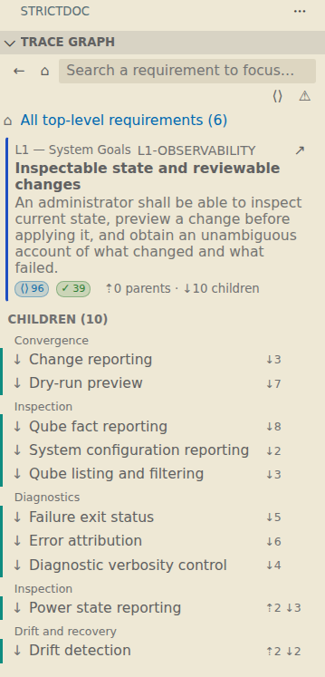
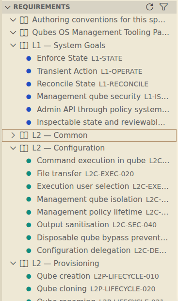
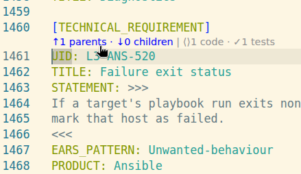

# StrictDoc Trace

A VS Code extension for [StrictDoc](https://strictdoc.readthedocs.io) projects.
It traces requirements (`.sdoc`) **down** to code and code (`@relation(...)`
markers) **up** to requirements, using StrictDoc's own Python API.

| Trace Graph | Requirements | CodeLens in `.sdoc` |
| :---: | :---: | :---: |
|  |  |  |

## Features

- **Trace Graph** view: the top-level requirements, and for a focused requirement a card
  (statement, link counts, code/test links) between its parents and children. It follows
  the cursor.
  Rows are grouped under their section and subsection headers (a section's own
  requirements first, then its subsections; a section holding only one subsection is shown
  as `Section » Subsection`).
- **Requirements** view: all requirements by document; filter to untraced ones.
- Hover, Go to Definition (F12), Find References and document links on
  UIDs in code and in `.sdoc` files.
- CodeLens: parent/child/code counts in `.sdoc`, the linked requirement in code.
- Diagnostics for StrictDoc build errors.
- Commands (`StrictDoc: ...`): Go to Requirement (`Ctrl+Alt+R`), Go to Code,
  Insert Relation Marker, Rebuild Index, Restart Server.
- Syntax highlighting for `.sdoc`.

The index is rebuilt when files are saved (StrictDoc reads from disk).

## Requirements

- Python 3.10+ with **strictdoc >= 0.30.1**. The server uses the `.venv` of the
  StrictDoc project folder (or `strictdoc.interpreter`, or `python3` from `PATH`):

    ```sh
    uv pip install --python .venv/bin/python "strictdoc>=0.30.1"
    ```

- The Python extension is **not** needed.

- Source traceability enabled in `strictdoc_config.py` is recommended; the
  extension enables it for its own index regardless.

## Project configuration

The extension builds its index from the folder holding the StrictDoc
configuration (`strictdoc_config.py` or `strictdoc.toml`), as
`cd <folder> && strictdoc export .` would.

- **One configuration** in the workspace: it is used automatically. Files are
  listed with `git ls-files`, so anything in `.gitignore` and the contents of
  submodules are skipped. Outside git, VS Code's file search is used.
- **Several, or none**: nothing is built until you pick one with
  **StrictDoc: Select Project Configuration…** (also offered by a notification
  and by the button in the Trace Graph view). The choice is saved
  as `strictdoc.projectPath` in the folder's `.vscode/settings.json`.
- Set `strictdoc.projectPath` yourself to override the detection.

If StrictDoc fails to build the index, the error is shown in the views and in a
notification. The full build log is in Output → StrictDoc Trace.

## Settings

| Setting                       | Default              | Description                                                   |
| ----------------------------- | -------------------- | ------------------------------------------------------------- |
| `strictdoc.projectPath`       | auto-detected        | Folder with the StrictDoc configuration (see above).          |
| `strictdoc.codeLens.enabled`  | `true`               | Show CodeLens.                                                |
| `strictdoc.interpreter`       | `[]`                 | Python used to run the server (see lookup order above).       |
| `strictdoc.importStrategy`    | `useBundled`         | Where the server's pygls libraries come from.                 |
| `strictdoc.showNotifications` | `off`                | When to show notifications.                                   |

## Code and tests

Links to source files are shown as code (⟨⟩) or tests (✓). A link is a test when its
StrictDoc role is `Verification` (or `Test`/`Tests`/`Testing`/`Validation`), set with
`ROLE:` on a `TYPE: File` relation or `role=` on an `@relation` marker. Links without a
role are tests when the path looks like one (`tests/`, `test_*.py`, `*_test.*`, `*.spec.*`).
### Requirements coverage

The Trace Graph shows StrictDoc's *requirements coverage with source* and *with tests*,
computed as in StrictDoc's tree map: a requirement is covered when it links a source file
(a test file: path containing `tests/`), or when all its child requirements are covered.

- Trace Graph rows show a yellow ⚠ pill only when under-covered. Hovering it shows
  covered/total bars for source and test coverage of that requirement and everything
  below it. The focused card shows the link counts and the same ⚠.
- On the top-level list, a ⚠ in the toolbar shows the same bars for the whole project.
- Toolbar toggles: **⟨⟩** shows code/test links (⟨⟩/✓ count pills on every row, CODE/TESTS
  lists in the card; off by default) and **⚠** shows or hides the coverage warnings.

## Colours

Requirements are coloured by depth in the parent/child graph (top level = `strictdoc.depth0`,
then `depth1` … `depth4`) along a blue → teal → green → yellow → orange scale, so
neighbouring levels are clearly different. Override them in
`workbench.colorCustomizations`, e.g. `"strictdoc.depth0": "#ff8800"`.
Code and test links use `strictdoc.codeLink` (ocean blue) and `strictdoc.testLink` (green).
In the Trace Graph, a requirement's ⟨⟩/✓ counts include all its sub-requirements; the
focused card lists its own links under CODE and TESTS.

## Development

```sh
uv sync && uvx nox -s setup     # Python env + bundled/libs
npm install && npm run compile
uv run pytest src/test/python_tests
npm run vsce-package            # -> strictdoc-trace.vsix
```

Press F5 to launch an Extension Development Host, then open
`src/test/python_tests/test_data/strictdoc_project`.

Based on [vscode-python-tools-extension-template](https://github.com/microsoft/vscode-python-tools-extension-template).
